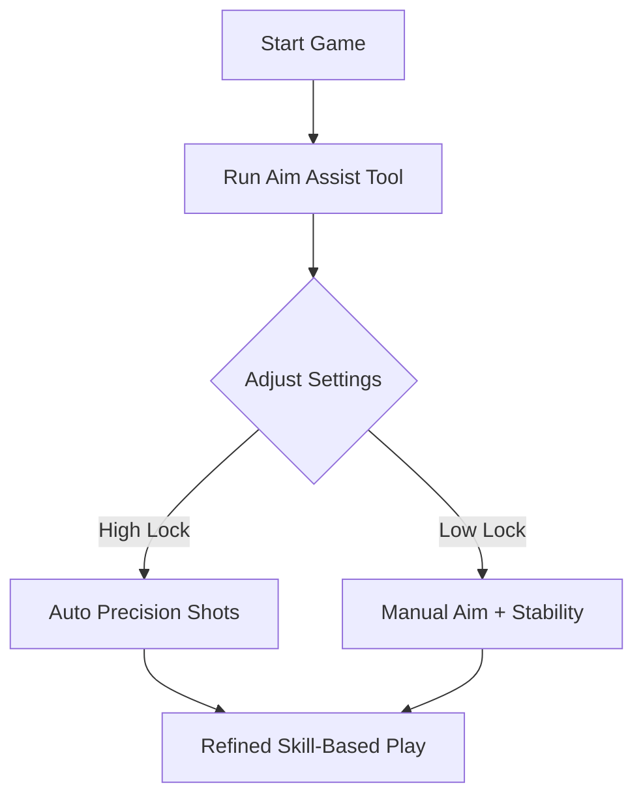

# Sniper Elite 5 Aim Assist Tool 🎯

The **Sniper Elite 5 Aim Assist** tool is designed for players who crave razor-sharp accuracy and smoother targeting during intense missions. By reducing scope sway, stabilizing recoil, and offering customizable aim locks, it helps both casual players and competitive sharpshooters make every bullet count.

No more wasted ammo or missed headshots—this assistive module ensures precision without stripping away the satisfaction of skillful sniping.

---

## 🔍 Overview

Sniper Elite 5’s sniping mechanics are challenging, blending bullet physics, wind, and recoil. While this creates realism, it can also frustrate players who want reliable consistency. Aim Assist provides a **configurable balance**: a targeting aid that respects player control while removing unnecessary frustration.

[!IMPORTANT]
This tool is intended for **offline single-player use** to enhance immersion and accessibility.

---

## 🛠 Features

* **Smart Aim Lock** – Automatically adjusts reticle for moving targets within range.
* **Scope Stabilizer** – Removes sway for long-distance shots.
* **Recoil Dampener** – Keeps rifles steady under repeated fire.
* **Custom Sensitivity Slider** – Adjust assist strength from 0–100%.
* **Hitbox Prioritization** – Toggle preference for head, torso, or limbs.
* **Adaptive Targeting** – Works seamlessly with scoped and iron-sight weapons.
* **Quick Toggle Keys** – F1–F5 bindings for instant switching.

---

[](#)
[](#)
[](#)
[](#)

---

## 💻 Compatibility

| Platform       | Status         | Notes                                 |
| -------------- | -------------- | ------------------------------------- |
| Windows 10/11  | ✅ Full Support | Steam and Game Pass tested            |
| Steam Deck     | ⚠️ Partial     | Requires Proton tweaks for smooth use |
| Linux (Proton) | ⚠️ Partial     | Overlay stability varies              |
| Consoles       | ❌ Unsupported  | Exclusively for PC                    |

[!NOTE]
Run the Aim Assist module **after launching Sniper Elite 5** for best detection.

---

## ⚡ Setup Guide

1. Download the Aim Assist package and extract it.
2. Launch *Sniper Elite 5*.
3. Run `SE5_AimAssist.exe` as Administrator.
4. Open the overlay with `Insert`.
5. Adjust assist sensitivity and targeting preferences.

```ini
[AimAssist]
Enable=1
LockStrength=75
PreferredHitbox=Head
ToggleKey=F1
```

---

## 📊 Workflow Diagram



---

## ❓ FAQ

**Q: Does Aim Assist work with every weapon?**
A: Yes, it supports all rifles, pistols, and SMGs with aim mechanics.

**Q: Can I adjust how strong the lock is?**
A: Absolutely—use the sensitivity slider in the overlay or edit the config file.

**Q: Is this detectable online?**
A: It’s designed for **offline play only**. Online use is discouraged.

**Q: Does it affect bullet physics (wind, drop)?**
A: No, physics remain intact—you still need skillful adjustments.

**Q: Will updates break this tool?**
A: Frequent patches ensure compatibility with the latest game version.

---

## 🎯 Final Thoughts

The **Sniper Elite 5 Aim Assist Tool** is the perfect companion for players who want **consistent accuracy and better control** without losing the challenge of realistic ballistics. Whether you’re clearing missions stealthily or going for high-scoring headshots, this tool ensures your shots land exactly where you want them.

[](#)
[](#)
[](#)

---

